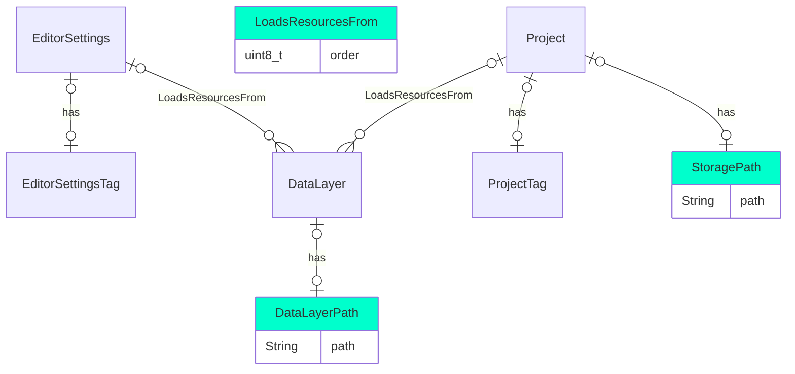
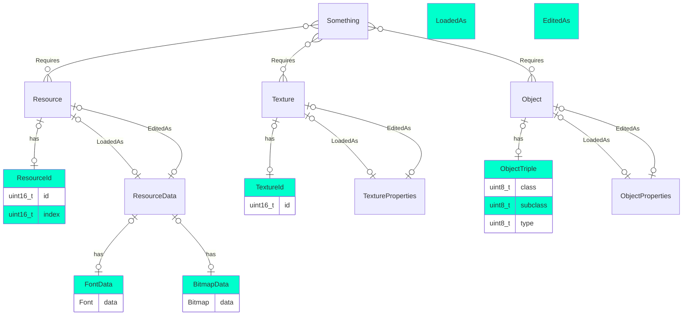

# Data layers and storage paths

Data layers is the general term for any resource-contributing sources. Typically, the base layer would be the game's
original resources, set as a standard entry in the editor's settings.

The final layer on the other side of the list is the storage for the loose resources of the project.

## Entities and components

# Resources

Resources are handled by the `ResourceSystem`, based on the `DataLayerPath`s, as well as what the editor overrides.

* Resource entities have a `ResourceId` component.
  They are created by either things that require them, or the `ResourceSystem` to indicate their availability.
* If a resource is edited as part of the current project, they will point to the corresponding resource data via
  'EditedAs'.
* If something requires a resource, the `ResourceSystem` will perform a load and then associate resource data
  via 'LoadedAs'.
* `ResourceData` entities then have components according to their types. Media data will have their dynamically
  allocated data as part of the components. Detailed data structures will have other components.

## Entities and components

